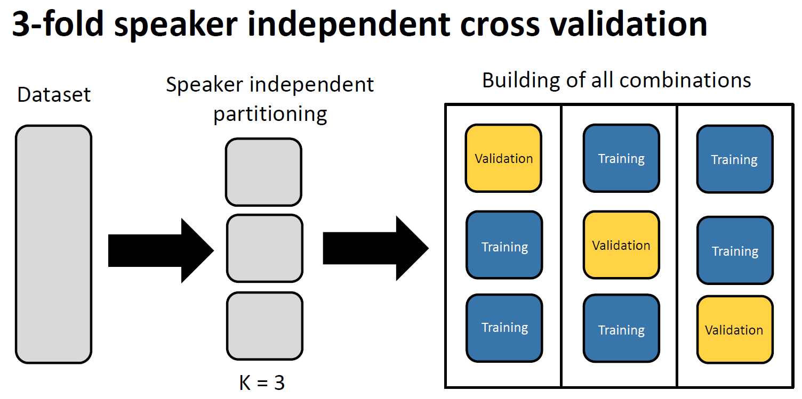
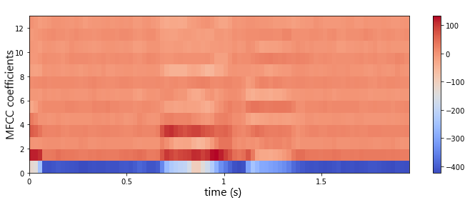
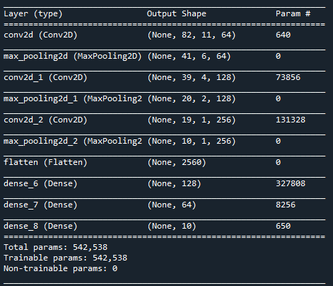
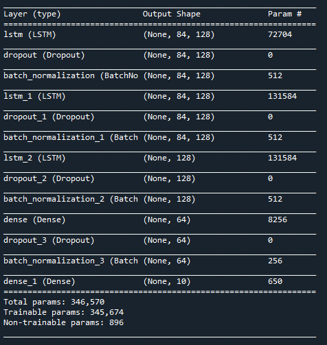
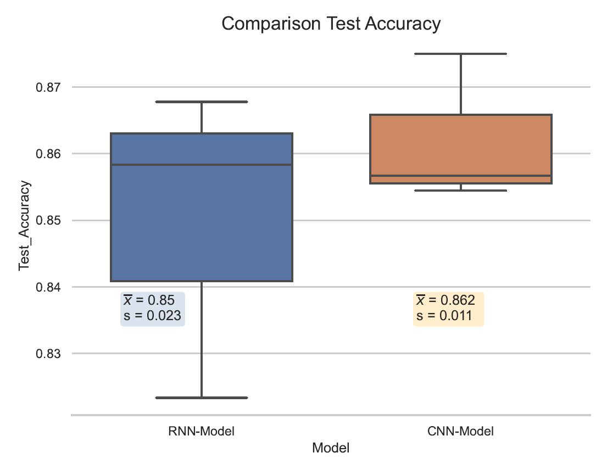
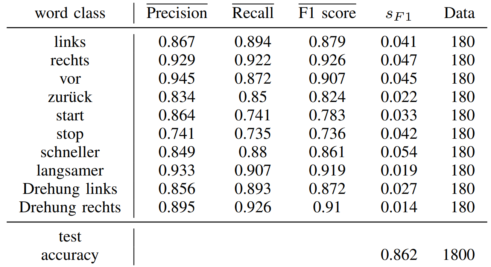
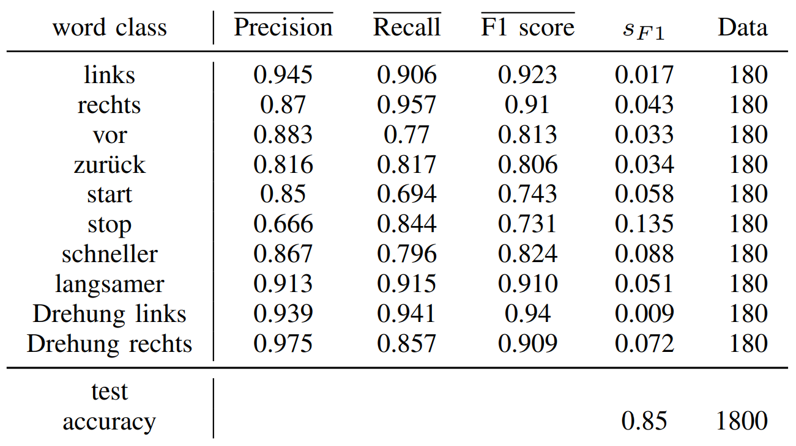
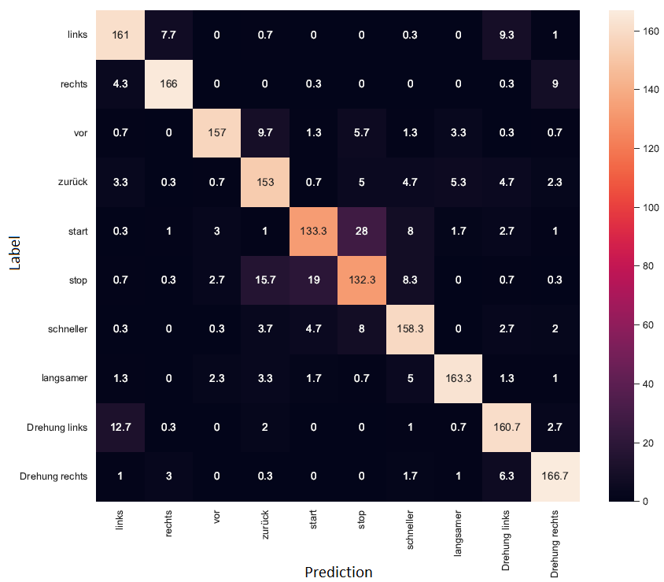
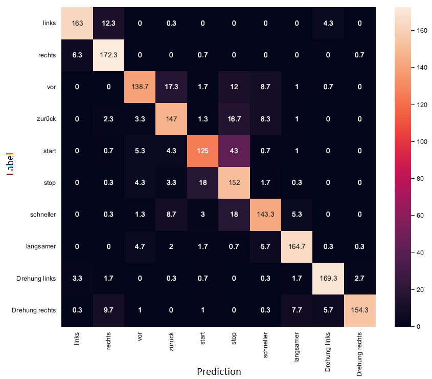

## Automatic Speech Recognition of command words with CNN and RNN-LSTM

### Project overview

* Realized a Automatic Speech Recognition system (ASR/NLP) to classificate command words with custom modeled CNN and RNN-LSTM
* Implementation in Python using the libraries Tensorflow, Keras and Librosa 
* Quantitative comparison and evaluation of both neural networks by 3-fold speaker independent cross validation, average evaluation metric scores (Precision, Recall, F1-Score, Accuracy)  confusion matrix and statistical t-Test analysis
* Achieved a classification accuracy of over 85% on average for both models

### Objective:
Speech recognition and classification of 10 command words ((1) links (2) rechts (3) vor (4) zurück (5) start (6) stop (7) schneller (8) langsamer
(9) drehung links (10) drehung rechts) using Long Short Term Memory (LSTM) and Convolutional Neural Networks (CNN). The system could 
be used on a higher level for the control of a robot via voice. 

### Part 1: Data acquisition
- Created a custom audio dataset by recording the 10 words from a total of 9 male and 9 female participants, with each command word recorded 30 times by the participants. (5400 audio files in total)
- Each audio of command word is saved in a separate WAV file (mono, 16-bit resolution, fixed sample rate, duration: 2 seconds)
- Script for automated recording: [AudioRecorder.py](https://github.com/nickjust/ASR_command_words/blob/main/AudioRecorder.py) 

### Part 2: Preprocessing 
- For the evaluation and validation of the two neural networks, a 3-fold speaker independent cross validation was chosen. For this purpose, the data set had to be divided into 3 equal parts. In order to develop a speaker-independent system, it was ensured that a speaker did not occur simultaneously in the training and validation data.

  

- Extraction of MFCC features (conversion of the audio signals into a time-frequency plane) for later classification with the help of Librosa, since the raw audio waveform is in general not directly used as an input vector for the machine/deep learning algorithms in the speech recognition domain. Illustration of the MFCC coefficients for an audio file of the used dataset (word: vor):

  

- Storage of training and validation datasets with MFCC coefficients and labels in .json format for further processing. (see script [preprocessing.py](https://github.com/nickjust/ASR_command_words/blob/main/preprocessing.py) for details)

### Part 3: Training of LSTM and CNN model for classification
- Self-developed and trained CNN and LSTM neural networks using the libraries Tensorflow and Keras for classification of the audio files 
(see script [model_train.py](https://github.com/nickjust/ASR_command_words/blob/main/model_train.py) and [main.py](https://github.com/nickjust/ASR_command_words/blob/main/main.py) for details).
- Hyperparametertuning of training parameters of both neural network architectures. Final architecture:
<table>
  <tr>
    <td>CNN Architecture</td>
     <td>LSTM Architecture</td>
  </tr>
  <tr>
    <td></td>
    <td></td>
  </tr>
</table>

- Trained 3 models each for CNN and LSTM  according to the previous  3-fold cross validation split and summarized the results computing and visualising average training and validation curves with ±1 s (standard deviation) during training process:

<table>
  <tr>
    <td>CNN training curves</td>
     <td>LSTM training curves</td>
  </tr>
  <tr>
    <td></td>
    <td></td>
  </tr>
 </table>

### Part 4: Results and Evaluation
- Comparison of the final weighted CNN and LSTM models accuracy on the test speaker independent validation or test data matching the 3-fold cross-validation. Visualization of the results through a boxplot. Furthermore, the accuracy averages of the three runs as well as their standard deviation are given for more accurate estimation.

  

- The two sample t-Test analysis implies that we do not have sufficient evidence to say that the average accuracy between the CNN and LSTM model is significantly different, because the p-value of the test comes out to be greater than $\alpha$ = 0.05 (set significance level). 

- A closer look was taken at the average Precision, Recall, and F1 score and F1 standard deviation of the models for a more detailed investigation of the classification performance and the weaknesses of both models with respect to individual command words:
<table>
  <tr>
    <td>Average values of Precision, Recall and F1 score and standard deviation from the F1 score of the CNN model
(validation data, K=3)</td>
     <td>Average values of Precision, Recall and F1 score and standard deviation from the F1 score of the LSTM model
(validation data, K=3)</td>
  </tr>
  <tr>
    <td></td>
    <td></td>
  </tr>
</table>

- Additional investigation with average confusion matrix for LSTM and CNN models revealed that the weaker performance of the classes start and stop in both models is due to frequent mutual misclassification. The command word stop is especially often incorrectly predicted as start and vice versa the command word start as stop: 
<table>
  <tr>
    <td>Confusion matrix CNN model on the validation datasets (average)</td>
    <td>Confusion matrix LSTM model on the validation datasets (average)</td>
  </tr>
  <tr>
    <td></td>
    <td></td>
  </tr>
</table>
